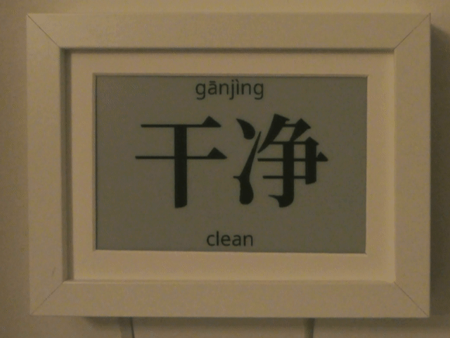

# hanzihua
Learning Chinese needs a constant effort, as you are rarely exposed it during daily life. So, I am making a picture
frame with an epaper display which shows me Chinese word per day:

## How does it work?
I am using Pleco to learn Chinese. It also has a flash card module, which stores my learning progress in a sqlite3
database. This database is backed up to AWS S3. So, the hanzihua downloads this file monthly and
creates pages for the 31 words with the lowest score. The page is switched daily.

## What does hanzihua mean?
Hànzì huà (written 汉字画) means painting with Chinese letter.

## Setup
Check the [documentation](doc/) for more details.