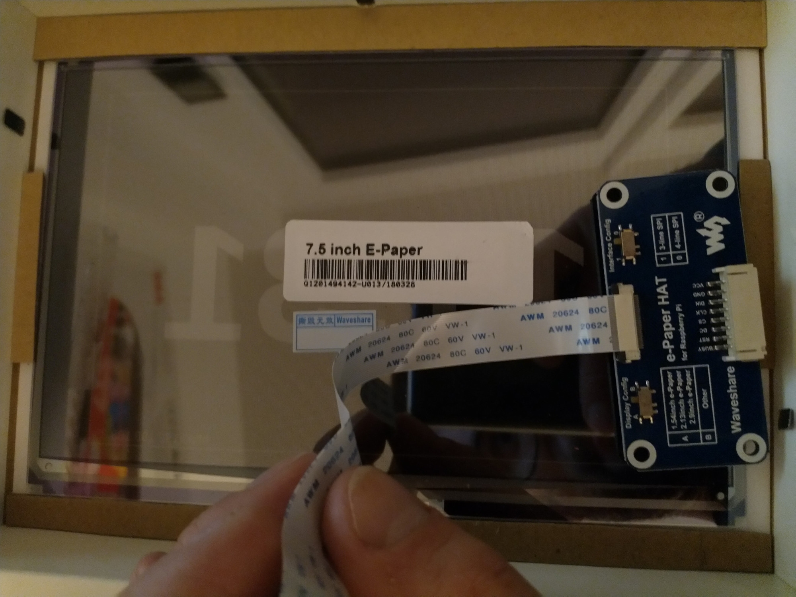
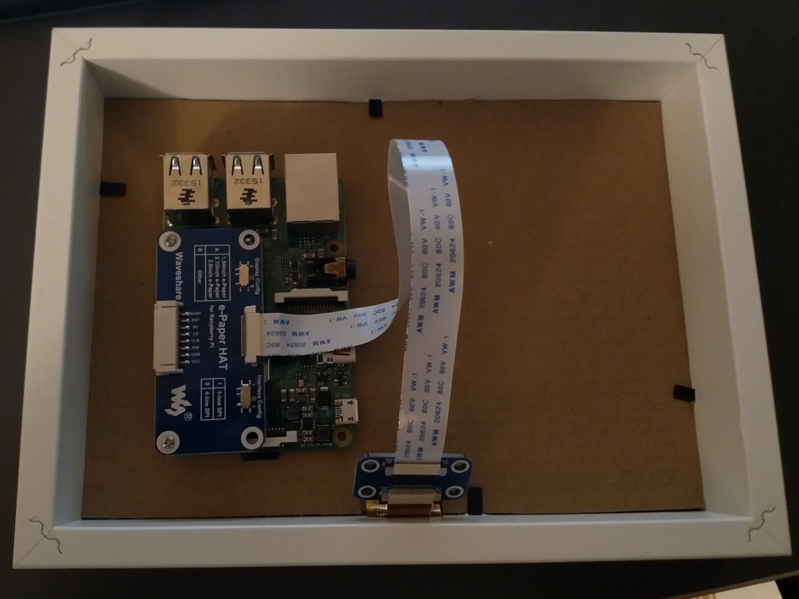
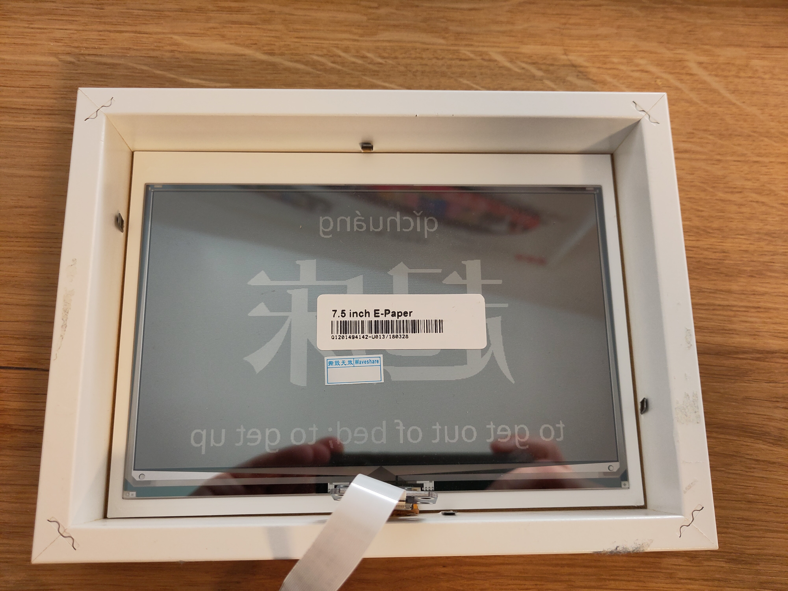
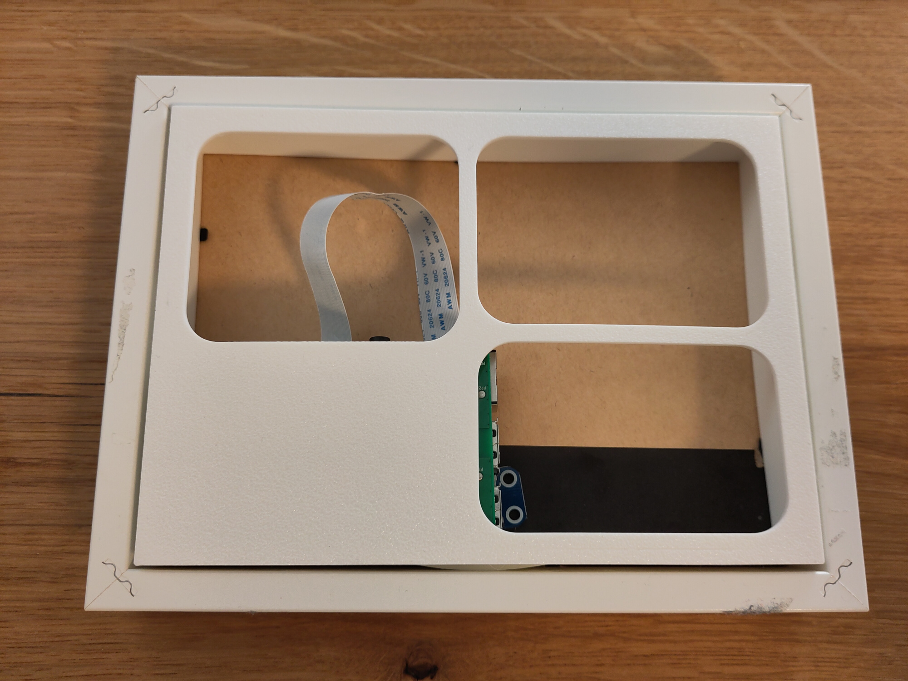

# Hardware

I used the following hardware:
- Raspberry Pi 2
- [Waveshare 7.5inch e-Paper HAT](https://www.waveshare.com/wiki/7.5inch_e-Paper_HAT)
- [IKEA picture frame](https://www.ikea.com/nl/en/p/ribba-frame-white-70378414/)

## 2021 Version
The e-Paper display fits nicely into the picture frame. I cut some
stripes of cardboard to place the display in the center of the picture
frame:



Adding another layer of cardboard to place the Raspberry Pi 2:



## 2025 Version
Use a 3D printer to print the passe-partout and the cover (see the `3d/` directory for the STEP files). These can be printed with PLA using standard settings on a Bambulab or similar printer. The display nicely fits into the passe-partout.



Cover it with some cardboard for protection, add the Raspberry Pi and close it with the cover. The ports of the Raspberry Pi remain accessible, while it is protected from falling out.



# Software

## System Configuration

The Raspberry Pi 2 is running on the Raspberry Pi OS Lite (bookworm).

You might want to add a file called `99norecommends` with the following content to `/etc/apt/apt.conf.d/`
to limit the amount of installed packages

```
APT::Get::Install-Recommends "false";
APT::Get::Install-Suggests "false";
```

Install updates

```bash
sudo apt update
sudo apt dist-upgrade
```


Go to `/boot/firmware/config.txt` and add `dtparam=spi=on`.

Reboot

## Install the requirements

```bash
sudo apt install git fonts-noto-core fonts-noto-cjk
```

Install [uv](https://docs.astral.sh/uv/getting-started/installation/).

## Download

```bash
git clone https://github.com/renevinaya/hanzihua.git
cd hanzihua
uv sync --extra display
```

The `--extra display` flag installs the additional dependencies needed to drive the e-Paper display via SPI. If you only want to generate pages without displaying them, `uv sync` is sufficient.

## Configuration

[Pleco](https://www.pleco.com/) is a Chinese dictionary and flashcard app. Hanzihua reads the Pleco flashcard database backup from AWS S3 to determine which words to display.

First, set up your AWS credentials in `~/.aws/credentials`:

```ini
[default]
aws_access_key_id = YOUR_ACCESS_KEY
aws_secret_access_key = YOUR_SECRET_KEY
```

Then edit `src/config.py` with your AWS S3 settings where the Pleco flashcard database backup is stored:

```python
REGION = "eu-central-1"
BUCKET = "my-backup-bucket"
PREFIX = "pleco/"
```

## Scheduling

The `create_pages.py` script must be run at least once before `display.py`, as it generates the page images in the `src/out/` directory.

Create a cron job to generate new pages monthly (as a regular user):

```bash
crontab -e
```

Add the following line (adjust the path to your clone location):

```
0 0 1 * * cd /home/pi/hanzihua && uv run src/create_pages.py
```

Create a cron job to update the display daily. SPI access requires root, or alternatively you can add your user to the `spi` and `gpio` groups:

```bash
sudo crontab -e
```

Add the following line (adjust the path to your clone location):

```
0 6 * * * cd /home/pi/hanzihua && uv run src/display.py
```
