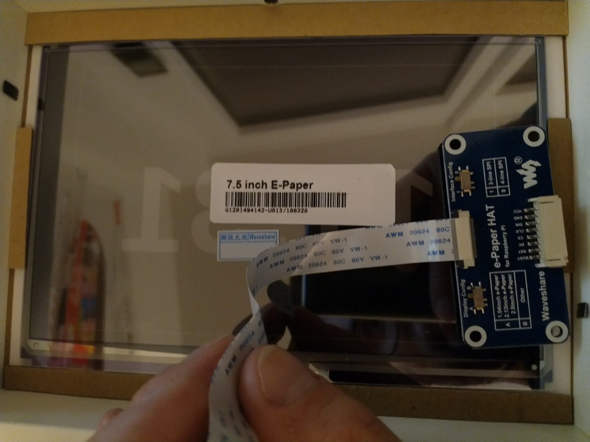

# Hardware

I used the following hardware:
- Raspberry Pi 2
- [Waveshare 7.5inch e-Paper HAT](https://www.waveshare.com/wiki/7.5inch_e-Paper_HAT)
- [IKEA picture frame](https://www.ikea.com/nl/en/p/ribba-frame-white-70378414/)

## 2021 Version
The e-Paper display fits nicely into the picture frame. I cut some
stripes of cardboard to place the display in the center of the picture
frame:



Adding another layer of cardboard to place the Raspberry Pi 2:


## 2025 Version
Use a 3D printer to print the passe-partout and the cover. The display nicely fits into the passe-partout.


Cover it with some cardboard for protection, add the Raspberry Pi and close it with the cover. The ports of the Raspberry Pi remain accessable, while it is protected from falling out.


# Software

## System Configuration

The Raspberry Pi 2 is running on the Raspberry Pi OS Lite (bookworm).

You might want to add a file with the following content to ```/etc/apt/apt.conf.d/```
to limit the amount of installed packages

```
APT::Get::Install-Recommends "false";
APT::Get::Install-Suggests "false";
```

Install updates

```bash
sudo apt update
sudo apt dist-upgrade
```


Go to ```/boot/config.txt``` and add ```dtparam=spi=on```.

Reboot

## Install the requirements

```bash
sudo apt install python3-pip python3-pil python3-numpy git fonts-noto-core fonts-noto-cjk
pip3 install RPi.GPIO spidev dragonmapper boto3
```

## Download

```bash
git clone https://github.com/renevinaya/hanzihua.git
```

Check source files for further actions.